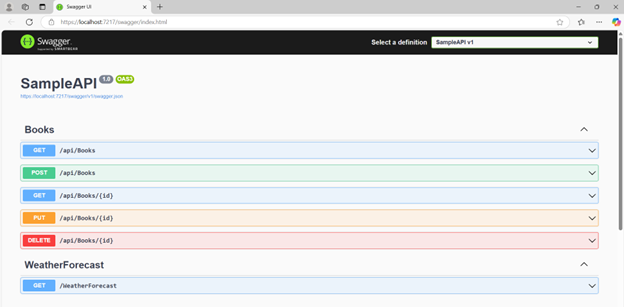
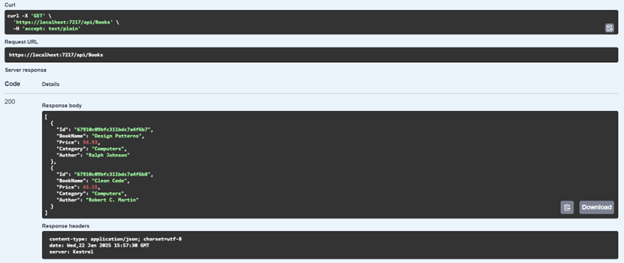

# BookStore API - Quản lý sách với MongoDB và .NET Core

## Giới thiệu
Dự án này là một ứng dụng Web API được xây dựng bằng **.NET Core** với **MongoDB** làm cơ sở dữ liệu. Ứng dụng hỗ trợ các chức năng CRUD (Tạo, Đọc, Cập nhật, Xóa) để quản lý danh sách sách trong một thư viện.

---

## Các bước thực hiện dự án

### 1. **Thiết lập cơ sở dữ liệu MongoDB**
- Cài đặt MongoDB và MongoDB Compass từ [trang chủ MongoDB](https://www.mongodb.com/docs/manual/installation/).
- Tạo cơ sở dữ liệu tên `BookStore` và collection `Books`.
- Thêm dữ liệu mẫu vào collection:
  ```json
  [
    {
      "Name": "Design Patterns",
      "Price": 54.93,
      "Category": "Computers",
      "Author": "Ralph Johnson"
    },
    {
      "Name": "Clean Code",
      "Price": 43.15,
      "Category": "Computers",
      "Author": "Robert C. Martin"
    }
  ]
  ```

### 2. **Tạo các lớp Model**
- Tạo lớp `Book` trong thư mục `Models` để biểu diễn một cuốn sách:
- Tạo lớp `BookStoreDatabaseSettings` để quản lý cấu hình kết nối MongoDB:

### 3. **Cấu hình MongoDB trong ứng dụng**
- Thêm cấu hình MongoDB vào file `appsettings.json`:
  ```json
  {
    "BookStoreDatabase": {
      "ConnectionString": "mongodb://localhost:27017",
      "DatabaseName": "BookStore",
      "BooksCollectionName": "Books"
    }
  }
  ```
- Đăng ký cấu hình và các dịch vụ trong `Program.cs`:
  ```csharp
  builder.Services.Configure<BookStoreDatabaseSettings>(
      builder.Configuration.GetSection("BookStoreDatabase"));
  builder.Services.AddSingleton<BooksService>();
  ```

### 4. **Xây dựng dịch vụ xử lý logic (Service)**
- Tạo lớp `BooksService` trong thư mục `Services` để quản lý tương tác với MongoDB:
  
### 5. **Xây dựng Controller**
- Tạo controller `BooksController` để xử lý các yêu cầu HTTP:

### 6. **Kiểm tra và chạy ứng dụng**
- Cấu hình Swagger để hiển thị và kiểm tra các API endpoint.
- Chạy ứng dụng và truy cập Swagger tại `https://localhost:{port}/swagger/index.html`.
  
---

## Kết quả đạt được

### 1. **Tích hợp MongoDB**
- Hệ thống sử dụng **MongoDB** để lưu trữ dữ liệu sách.
- Dữ liệu mẫu được thêm thành công với các sách như:
  - "Design Patterns"
  - "Clean Code"

### 2. **Cung cấp API RESTful đầy đủ chức năng**
- Đã xây dựng các endpoint hỗ trợ đầy đủ CRUD (Tạo, Đọc, Cập nhật, Xóa).
- Kết hợp với Swagger UI để kiểm tra và thực thi API dễ dàng.

### 3. **Hỗ trợ kiểm tra thông qua Swagger**
- Truy cập Swagger tại `https://localhost:{port}/swagger/index.html`.
- Thực hiện và kiểm tra API một cách trực quan.

### 4. **Cấu hình dễ dàng**
- Cấu hình kết nối MongoDB được lưu trong `appsettings.json` và có thể tùy chỉnh linh hoạt:
  ```json
  {
    "BookStoreDatabase": {
      "ConnectionString": "mongodb://localhost:27017",
      "DatabaseName": "BookStore",
      "BooksCollectionName": "Books"
    }
  }
  ```

## Thông tin API

### 1. **Lấy danh sách tất cả các sách**
- **Endpoint**: `GET /api/books`
- **Mô tả**: Trả về danh sách tất cả các sách có trong cơ sở dữ liệu.
- **Hình minh chứng**:
  

### 2. **Lấy thông tin chi tiết một sách**
- **Endpoint**: `GET /api/books/{id}`
- **Mô tả**: Lấy thông tin chi tiết của một cuốn sách dựa trên ID.

### 3. **Thêm một sách mới**
- **Endpoint**: `POST /api/books`
- **Mô tả**: Thêm một sách mới vào cơ sở dữ liệu.

### 4. **Cập nhật thông tin sách**
- **Endpoint**: `PUT /api/books/{id}`
- **Mô tả**: Cập nhật thông tin của một sách dựa trên ID.

### 5. **Xóa sách**
- **Endpoint**: `DELETE /api/books/{id}`
- **Mô tả**: Xóa một sách khỏi cơ sở dữ liệu dựa trên ID.

---

## Ghi chú
- Đảm bảo MongoDB đang chạy trước khi khởi động ứng dụng.
- Nếu bạn muốn thay đổi cấu hình kết nối, sửa file `appsettings.json`.
- Cơ sở dữ liệu và các collection sẽ tự động được tạo khi ứng dụng chạy lần đầu.

---

## Tham khảo
- [MongoDB Documentation](https://www.mongodb.com/docs)
- [ASP.NET Core Web API Documentation](https://learn.microsoft.com/en-us/aspnet/core)
